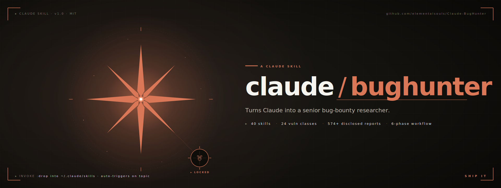
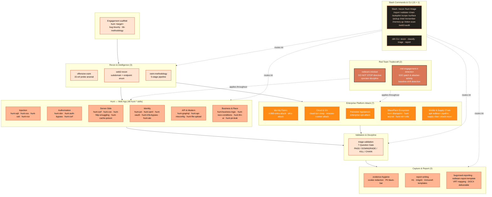

# claude-bughunter

> A self-contained Claude skill bundle for bug hunting and external red-team work · **71 skills** · 15 slash commands · **681 disclosed-report patterns** across 24 core vulnerability classes · enterprise identity + infrastructure attack matrices · engagement-folder scaffolding · Burp MCP integration · battle-tested across authorized red-team and bug-hunting engagements, plus public training platforms (DVWA, OWASP Juice Shop, Hacker101, testphp.vulnweb.com).

Built by **[Sachin Sharma](https://www.linkedin.com/in/sachinsharma8080/)** — Bug Hunting & GenAI Security Research.

<p align="center">
  <sub>SPONSORED BY</sub>
  <br/>
  <a href="https://www.atlascloud.ai/console/coding-plan">
    <picture>
      <source media="(prefers-color-scheme: dark)" srcset="assets/sponsors/atlas-cloud-dark.svg">
      
    </picture>
  </a>
</p>

---

## What is this?

`claude-bughunter` is a drop-in skill bundle for the [Claude Code skills system](https://docs.claude.com/en/docs/claude-code/skills). Install once and Claude Code stops being a chatbot and starts behaving like a senior bug-hunting researcher or red-team operator: it knows the techniques, the chain templates, the VRT mappings, the platform CVE chains, and the hygiene — and it stays in scope.

Four layers stack:

- **`bug-bounty` + `bb-methodology` + `redteam-mindset`** — *how to think.* 5-phase non-linear hunting workflow, critical-thinking framework, developer-psychology heuristics, anomaly detection patterns, and the red-team operator-discipline corrections (when scope is "external red team" not "bug hunting / WAPT").
- **48 `hunt-*` skills + `security-arsenal`** — *what to look for in webapps.* Per-class detection patterns, payloads, bypass tables, and chain templates — the original 24 per-class skills curated from 681 disclosed HackerOne reports, plus 20+ framework/surface skills (Next.js, Spring Boot, Laravel, Kubernetes, CI/CD, gRPC, WebSocket, deserialization, …) from the community v3 expansion.
- **Enterprise platform attack chains** — *what to look for on the perimeter.* `m365-entra-attack`, `okta-attack`, `cloud-iam-deep`, `vmware-vcenter-attack`, `enterprise-vpn-attack`, `hunt-sharepoint`, `hunt-aspnet`, `hunt-ntlm-info`, `apk-redteam-pipeline`, `supply-chain-attack-recon` — current 2024-2026 CVE chains, AADSTS error references, version-fingerprint matrices, and post-credential escalation paths.
- **`triage-validation` + `bugcrowd-reporting` + `evidence-hygiene` + `redteam-report-template` + `mid-engagement-ir-detection`** — *how to ship it.* 7-Question Gate, VRT category fallback, severity-request paragraphs, OOS rebuttals, cookie/PII redaction, client-facing red-team deliverable format, and SOC-patch / mid-engagement-attacker detection methodology.

All triggered automatically by topic — describe what you're testing in plain English and the relevant skill loads. No invocation by name.

> **71 skills · 15 commands · 681 disclosed reports curated · 6-phase workflow · exercised against public training platforms (DVWA, OWASP Juice Shop, Hacker101, testphp.vulnweb.com) and calibrated through authorized real-world engagements.**

---

## Quickstart

**Option A — install as a Claude Code plugin (recommended).** From inside Claude Code:

```text
/plugin marketplace add elementalsouls/Claude-BugHunter
/plugin install claude-bughunter@elementalsouls
```

All 71 skills + 15 commands load namespaced under `claude-bughunter:` and update when you bump the plugin version — no files copied into `~/.claude/`.

**Option B — copy install (no plugin system / pin to a clone):**

```bash
git clone https://github.com/elementalsouls/Claude-BugHunter.git
cd Claude-BugHunter
bash scripts/install.sh        # copies skills + commands into ~/.claude/
```

That's it. Open Claude Code and describe what you're testing in plain English — the right skill loads automatically, no invocation by name:

```text
> Testing acme.com — an in-scope HackerOne target. Run recon and rank the surface.

  ⟳ loading skills: web2-recon, offensive-osint, bb-methodology …
  → subdomain enum (subfinder + crt.sh) … 47 hosts
  → live hosts (httpx) … 12 · tech fingerprint … 6 distinct stacks
  → ranked surface: api.acme.com (GraphQL, introspection ON)  ← start here
                    auth.acme.com (OAuth, SSO)               ← hunt-oauth
  Next: want me to probe the GraphQL introspection + OAuth redirect_uri?
```

→ Full [Installation guide](INSTALL.md) · [Usage guide](USAGE.md) · [searchable skill catalog](docs/skills.md).

> The block above is an illustrative transcript. To record a real demo of your own session: `asciinema rec demo.cast` → upload to [asciinema.org](https://asciinema.org) and drop the badge here.

---

## Scope — what this bundle is for, and what it isn't

This bundle covers the **external attack surface** — anything reachable from the internet without first compromising an internal endpoint.

### In scope

- **Bug bounty hunting** — web apps, APIs, SaaS, GraphQL, OAuth, JWT, file upload, IDOR, SSRF, RCE chains
- **Web application pentesting** — full hunt-* coverage of OWASP-mapped bug classes + discipline rules
- **External red-team engagements** — initial-access against internet-facing enterprise estate: M365 / Entra ID, Okta-as-IdP, SharePoint on-prem (ToolShell + legacy SOAP), VMware vCenter / Workspace ONE, SSL VPN appliances (Cisco / Fortinet / Citrix / Palo Alto / Pulse / SonicWall / F5), Android APK red-team, supply-chain recon
- **Cloud misconfig + post-credential escalation** — public S3, IMDS chains, STS AssumeRole, cross-account confused-deputy
- **Recon + OSINT** — subdomain enum, identity-fabric mapping, certificate transparency, JS analysis, secret scanning
- **Reporting** — H1, Bugcrowd (VRT-aware), Intigriti, Immunefi, plus client-facing red-team deliverable format

### Out of scope (deliberate — not gaps, design decisions)

- **Internal Active Directory attacks** — BloodHound, Kerberoasting, ASREProast, DCSync, Pass-the-Hash, AD CS abuse, ntlmrelayx, Responder, PetitPotam, etc. Different operational risk profile; needs different tooling and judgment. **Future bundle, not this one.**
- **C2 frameworks** — Cobalt Strike, Sliver, Mythic, Havoc, BRC4 tradecraft. Out of scope for external-only engagement model.
- **Post-exploit / persistence / lateral** — Mimikatz/comsvcs LSASS dumping, golden/silver tickets, named-pipe impersonation, persistence (registry, scheduled tasks, WMI events, COM hijacking), token theft. These start after the perimeter has already broken — different bundle territory.
- **Evasion** — AMSI bypass, ETW patching, AV/EDR bypass. Tied to C2 tradecraft above.
- **iOS pentesting / hardware / RF / ICS** — out of scope by design.
- **Binary exploitation / kernel pwn / browser internals** — different skill universe.

If you're running an internal red team that includes domain-takeover chains via Kerberos or lateral movement, **this bundle won't help you in those phases** — and we'd rather say that up front than have you find out mid-engagement. The external surface handoff to internal-RT tooling (Impacket, NetExec, CrackMapExec, Rubeus, Certify, BloodHound) is intentionally outside our scope. **Coverage for internal AD and post-exploit may come in a future update.**

---

## Capability Map

The 71 skills group into 7 capability domains. Each box below is a real skill on disk. Skills auto-load when their description keywords match what you're describing to Claude.



---

## Engagement Flow

Every engagement follows the same 6-phase loop. Skills auto-load at each phase. The Validate gate has 4 possible outcomes — only **PASS** or **DOWNGRADE** continue forward to a report; **KILL** and **CHAIN REQUIRED** return you to Hunt with a verdict that prevents wasted reporting effort.

```mermaid
flowchart TD
    classDef phase fill:#FFB591,stroke:#DA7756,stroke-width:3px,color:#080705
    classDef gate fill:#FF8B14,stroke:#23201C,stroke-width:2px,color:#fff
    classDef decision fill:#FFE4D1,stroke:#DA7756,stroke-width:2px,color:#080705
    classDef terminal fill:#23201C,stroke:#DA7756,stroke-width:2px,color:#FFE4D1
    classDef discipline fill:#DA7756,stroke:#23201C,stroke-width:2px,color:#fff

    Start(["🎯 Engagement starts"]):::terminal --> Mode

    Mode{"Engagement mode?<br/><i>bb-methodology Part 0</i>"}:::decision
    Mode -->|"Bug Bounty"| Scope
    Mode -->|"Red Team"| RTSetup
    Mode -->|"Pentest"| Scope

    RTSetup["Load red-team layer<br/><b>redteam-mindset</b><br/>DO NOT STOP directive<br/><b>mid-engagement-ir-detection</b>"]:::discipline
    RTSetup --> Scope

    Scope["<b>1. SCOPE</b><br/>hunt &lt;target&gt; → scaffold folder<br/>Parse program rules<br/>Fill scope.md<br/><i>skills: bug-bounty, bb-methodology</i>"]:::phase
    Scope --> Recon

    Recon["<b>2. RECON</b><br/>Subdomain enum · endpoint mapping<br/>JS bundle harvest · identity fabric<br/><i>skills: offensive-osint, web2-recon</i><br/>commands: /recon · cbh recon &lt;target&gt;"]:::phase
    Recon --> Hunt

    Hunt["<b>3. HUNT</b><br/>Test bug-class hypotheses<br/>Apply payloads from Pattern Libraries<br/><i>48 hunt-* skills auto-load by keyword</i><br/>commands: /hunt · /chain"]:::phase
    Hunt --> Found{"Lead<br/>found?"}:::decision
    Found -->|"no"| Hunt
    Found -->|"yes"| Validate

    Validate["<b>4. VALIDATE</b><br/>Run the 7-Question Gate<br/>Q1: real HTTP request?<br/>Q2: accepted-impact list?<br/>Q3: in scope?<br/>Q4: no admin-only assumption?<br/>Q5: not already known?<br/>Q6: concrete impact, not 'technically possible'?<br/>Q7: not on never-submit list?<br/><i>skill: triage-validation</i><br/>command: /triage"]:::phase
    Validate --> Verdict{"Gate verdict"}:::gate

    Verdict -->|"PASS<br/>(all 7 ✓)"| Capture
    Verdict -->|"DOWNGRADE<br/>(Q2 or Q5 fail)"| Capture
    Verdict -->|"CHAIN REQUIRED<br/>(needs another primitive)"| Hunt
    Verdict -->|"KILL<br/>(any other failure)"| Hunt

    Capture["<b>5. CAPTURE</b><br/>Cookie redaction · PII black-bar<br/>HAR sanitization · screenshot order<br/><i>skill: evidence-hygiene</i>"]:::phase
    Capture --> Report

    Report["<b>6. REPORT</b><br/>Draft per platform template<br/>H1 / Bugcrowd VRT / Intigriti / Immunefi<br/>or client-facing DOCX (red-team)<br/><i>skills: report-writing, bugcrowd-reporting,<br/>redteam-report-template</i><br/>command: /report"]:::phase
    Report --> Submit(["📨 Submit"]):::terminal

    Submit --> Track["Append UUID to submissions.txt<br/>Cross-reference future chains<br/>command: /remember"]
    Track --> Hunt
```



**Key properties of this flow:**

- **Validate gate is non-optional.** Even if you're confident a finding is real, route it through `/triage` first. The gate is what separates productive researchers from N/A noise. Reported as the single most useful step by every researcher who used the bundle.
- **KILL returns to Hunt, not to "end of engagement."** A killed lead doesn't mean the engagement is over — it means *that specific lead* is dead. Keep hunting.
- **CHAIN REQUIRED is a real verdict.** Many high-severity findings only land as Critical when chained with another primitive (e.g., user-enum + no-rate-limit + weak password policy = ATO). The verdict tells you "go find the other half before reporting."
- **Track loops back.** Once you submit, the engagement isn't done. Open leads exist; chained reports cross-reference submission UUIDs. The `/remember` command persists this state across Claude Code sessions.
- **Red-team mode adds a discipline layer.** When mode=Red Team, `redteam-mindset` and `mid-engagement-ir-detection` are loaded throughout — applying "DO NOT STOP" discipline at every step and watching for client-SOC mid-engagement patches.

---

## Two interfaces — pick what fits your engagement

The bundle exposes the same content through two interfaces. **Slash commands are the primary interface**; the `cbh` CLI is a secondary terminal-native runner. Both consume the same `skills/` content; they differ in execution model.

| | Slash commands (PRIMARY) | `cbh` CLI (SECONDARY) |
|---|---|---|
| Runs in | A Claude Code conversation | Any terminal with Python 3.9+ |
| Execution | LLM-driven — reads full SKILL.md, applies judgment, can chain skills, can converse | Deterministic — Python stdlib, regex match, real `subfinder`/`dig`/`curl` calls |
| Output | Conversational, contextual, varies per run | Files + structured stdout, identical across runs |
| Best for | Hunting, chain construction, applying discipline rules with nuance, talking through findings | CI/CD, scripted automation, bulk recon, deterministic verification, non-Claude environments |
| Examples | `/recon target.com` `/hunt target.com` `/triage` `/report` `/validate` `/chain` `/autopilot` `/scope` | `cbh recon target.com` (real network I/O) · `cbh triage finding.md` (deterministic 7Q grep) · `cbh report finding.md --platform bugcrowd` |

**Choose by use case:**

- **Exploring a new target?** Use Claude Code with slash commands. The LLM applies judgment that the deterministic CLI can't.
- **Running scheduled recon? Verifying labs? CI gate?** Use `cbh`. It's reproducible and scriptable.
- **You don't have Claude Code installed but want to read the skills/Pattern Libraries?** Use `cbh` plus `cat skills/<name>/SKILL.md`. The content stands on its own.

See [`docs/cbh-cli.md`](docs/cbh-cli.md) for the CLI reference. See the slash command list under **Slash Commands** later in this file for the conversational interface.

---

## Structure

```
Claude-BugHunter/
├── skills/                                  # 71 SKILL.md bundles
│   ├── apk-redteam-pipeline/                     # APK acquisition → jadx → secrets → Frida
│   ├── bb-local-toolkit/                         # full bug-bounty workflow pipeline router
│   ├── bb-methodology/                           # 5-phase non-linear hunting workflow (vendored)
│   ├── bug-bounty/                               # master orchestrator (vendored)
│   ├── bugcrowd-reporting/                       # VRT, OOS rebuttals, severity requests
│   ├── cloud-iam-deep/                           # AWS/Azure/GCP IAM priv-esc chains
│   ├── enterprise-vpn-attack/                    # Cisco/Fortinet/Citrix/PAN/Pulse SSL VPN
│   ├── evidence-hygiene/                         # cookie/PII/HAR redaction discipline
│   ├── hunt-api-misconfig/                       # mass assignment, JWT, prototype pollution
│   ├── hunt-aspnet/                              # ASP.NET ViewState, machineKey, WebForms
│   ├── hunt-ato/                                 # 9 account-takeover paths + chains
│   ├── hunt-auth-bypass/                         # auth bypass + function-level authz
│   ├── hunt-brute-force/                         # login / OTP brute force, credential stuffing
│   ├── hunt-business-logic/                      # business logic flaws — 7 disclosed reports
│   ├── hunt-cache-poison/                        # cache poisoning — 4 disclosed reports
│   ├── hunt-cicd/                                # CI/CD — GH Actions injection, Jenkins RCE, runner tokens
│   ├── hunt-cloud-misconfig/                     # S3, Lambda, RDS, IAM-in-JS, metadata SSRF
│   ├── hunt-cors/                                # CORS — reflect-origin + creds, null origin, regex
│   ├── hunt-csrf/                                # CSRF — 10 disclosed reports
│   ├── hunt-deserialization/                     # Java/PHP/.NET/pickle gadget chains, Log4Shell
│   ├── hunt-dispatch/                            # /hunt mode router (redteam vs WAPT)
│   ├── hunt-dom/                                 # DOM clobbering, postMessage, client-side proto pollution
│   ├── hunt-file-upload/                         # webshell, SVG XSS, DOCX XXE, traversal
│   ├── hunt-graphql/                             # GraphQL — 3 disclosed reports
│   ├── hunt-grpc/                                # gRPC reflection enum, missing auth, CVE-2023-44487
│   ├── hunt-host-header/                         # host header injection — reset poisoning → ATO, SSRF
│   ├── hunt-http-smuggling/                      # CL.TE / TE.CL request smuggling
│   ├── hunt-idor/                                # IDOR — 26 disclosed reports
│   ├── hunt-k8s/                                 # Kubernetes/Docker — anon API, kubelet, etcd, docker.sock
│   ├── hunt-laravel/                             # Laravel — Ignition RCE, debug leak, APP_KEY
│   ├── hunt-ldap/                                # LDAP / XPath injection, AD exfil
│   ├── hunt-lfi/                                 # LFI/RFI/path traversal, PHP wrappers, log poisoning
│   ├── hunt-llm-ai/                              # prompt injection, ASCII smuggling, ASI01-10
│   ├── hunt-mfa-bypass/                          # 7 MFA/2FA bypass patterns
│   ├── hunt-misc/                                # catch-all — 225 disclosed reports
│   ├── hunt-nextjs/                              # Next.js — Server Actions, middleware bypass, image SSRF
│   ├── hunt-nodejs/                              # Node.js — prototype-pollution → RCE, EJS/Pug SSTI
│   ├── hunt-nosqli/                              # NoSQL injection — Mongo operators, Redis-via-SSRF
│   ├── hunt-ntlm-info/                           # NTLM Type-2 AD topology disclosure
│   ├── hunt-oauth/                               # OAuth — 10 disclosed reports
│   ├── hunt-open-redirect/                       # open redirect → OAuth token-theft chain
│   ├── hunt-race-condition/                      # race conditions — 3 disclosed reports
│   ├── hunt-rce/                                 # RCE — 67 disclosed reports
│   ├── hunt-saml/                                # SAML XSW1–XSW8 + SSO attacks
│   ├── hunt-session/                             # session fixation, low-entropy, missing invalidation
│   ├── hunt-sharepoint/                          # SharePoint on-prem (ToolShell, anon SOAP)
│   ├── hunt-source-leak/                         # JS source maps, .git, .DS_Store, exposed Swagger
│   ├── hunt-springboot/                          # Spring Boot — Actuator, SpEL, Spring4Shell, H2, Jolokia
│   ├── hunt-sqli/                                # SQLi — 8 disclosed reports
│   ├── hunt-ssrf/                                # SSRF — 9 disclosed reports
│   ├── hunt-ssti/                                # SSTI: Jinja/Twig/FreeMarker/ERB/Spring
│   ├── hunt-subdomain/                           # subdomain takeover — 11 disclosed reports
│   ├── hunt-tls-network/                         # TLS/DNS — HSTS, weak ciphers, AXFR, SPF/DMARC
│   ├── hunt-websocket/                           # CSWSH, missing auth, message tampering
│   ├── hunt-xss/                                 # XSS — 174 disclosed reports
│   ├── hunt-xxe/                                 # XXE — 4 disclosed reports
│   ├── m365-entra-attack/                        # M365/Entra full chain (AADSTS, CA, ROPC)
│   ├── meme-coin-audit/                          # token rug-pull + SPL/Token-2022 audit
│   ├── mid-engagement-ir-detection/              # detect SOC patches + attacker activity mid-test
│   ├── offensive-osint/                          # 15-reference probe arsenal
│   ├── okta-attack/                              # Okta IdP enum, factor flows, push fatigue
│   ├── osint-methodology/                        # 5-stage recon + asset graph
│   ├── redteam-mindset/                          # red-team operator discipline + DO NOT STOP
│   ├── redteam-report-template/                  # client-facing deliverable format
│   ├── report-writing/                           # H1/Bugcrowd/Intigriti templates (vendored)
│   ├── security-arsenal/                         # payloads + bypass tables (vendored)
│   ├── supply-chain-attack-recon/                # dep-confusion, GH Actions, SBOM mining
│   ├── triage-validation/                        # 7-Question Gate + 4 validation gates (vendored)
│   ├── vmware-vcenter-attack/                    # vCenter/Workspace ONE/Aria CVE chain
│   ├── web2-recon/                               # subdomain enum, host discovery (vendored)
│   └── web3-audit/                               # 10 DeFi bug classes (vendored)
├── commands/                                # 15 slash commands
├── scripts/
│   ├── hunt.sh                              # engagement-folder scaffolder
│   ├── install.sh                           # single-step installer
│   ├── install-community-skills.sh          # optional: refresh vendored upstream
│   ├── cbh.py                               # terminal-native CLI runner
│   └── refresh-cve-index.py                 # CISA KEV refresh against in-scope vendors
├── docs/                                    # architecture · credits · CLI reference · CVE coverage · pattern libraries · verification labs
├── assets/                                  # banner + architecture / capability-map / engagement-flow SVGs
└── README.md · INSTALL.md · USAGE.md · CONTRIBUTING.md · SECURITY.md · LICENSE
```

Drop the contents of `skills/` into `~/.claude/skills/` and Claude auto-triggers on relevant phrases. The `install.sh` script does this plus copies commands to `~/.claude/commands/` and wires `hunt.sh` into your shell rc.

---

## Skill Index

71 skills across 7 capability domains + 15 slash commands. **Skills auto-load by keyword** — you don't invoke them by name; describe what you're testing in plain English and the matching skill loads.

> The tables below highlight the curated per-class core. For the **complete, always-current list of all 71 skills** (including the v3 framework/surface additions — Next.js, Spring Boot, Laravel, K8s, CI/CD, gRPC, WebSocket, LFI, NoSQLi, …), see the auto-generated [skill catalog](docs/skills.md).

### Quick lookup — find a skill by what you're seeing

The fastest way to land on the right skill. If you see the pattern in the left column, the right column is the skill that loads.

| When you see this on the target… | Skill that loads |
|---|---|
| Reflected user input echoed back in HTML / JS context | `hunt-xss` |
| User-controlled value in a database query response | `hunt-sqli` |
| Numeric ID in URL or body (`/users/42`, `?invoice_id=12345`) | `hunt-idor` |
| URL parameter accepting URLs (`?url=`, `?next=`, `?redirect=`, `?callback=`) | `hunt-ssrf` |
| File upload form / `/avatar`, `/attachment`, `/import` endpoint | `hunt-file-upload` |
| GraphQL endpoint (`/graphql`, `/v1/graphql`, GraphiQL playground) | `hunt-graphql` |
| ASP.NET `__VIEWSTATE` field in form / WebForms / `.aspx` paths | `hunt-aspnet` |
| Cisco WebVPN cookie + `/+CSCOE+/logon.html` redirect | `enterprise-vpn-attack` |
| Microsoft `login.microsoftonline.com` SAML redirect | `m365-entra-attack` |
| Okta tenant subdomain (`*.okta.com`, `*.oktapreview.com`) | `okta-attack` |
| Login form with no rate-limit on credential check | `hunt-auth-bypass` + `hunt-ato` |
| OTP / 2FA flow with retry button | `hunt-mfa-bypass` |
| JWT token in cookie / Authorization header | `hunt-api-misconfig` (JWT attacks inside) |
| Public S3 bucket / Lambda URL / kubelet :10250 / Docker :2375 | `hunt-cloud-misconfig` |
| SharePoint farm path (`/_layouts/15/`, `/_vti_bin/`) | `hunt-sharepoint` |
| `/api/users/{id}` PUT / DELETE on a SaaS REST API | `hunt-idor` + `hunt-api-misconfig` |

If none of the above match: tell Claude *"I want to test for X"* (where X is the bug class) and the relevant `hunt-*` loads.

---

### Web Application Hunting (13 skills)

| Skill | What it covers | Coverage source |
|---|---|---|
| `hunt-aspnet` | **ASP.NET ViewState · machineKey · WebForms · WCF · request-validator bypass** | authorized-engagement |
| `hunt-csrf` | Cross-site request forgery (chain-required impact) | 10 H1 reports |
| `hunt-dom` | Client-side DOM — DOM clobbering, postMessage abuse, client-side prototype pollution, CSS exfil | community v3 |
| `hunt-file-upload` | File upload bypass — 10 techniques (double-ext, magic-bytes, polyglot, ZIP slip, SVG XSS) | curated |
| `hunt-host-header` | Host header injection — reset-poisoning → ATO, routing-based SSRF, OAuth redirect poisoning | community v3 |
| `hunt-idor` | IDOR / broken object-level authorization · cross-tenant access | 26 H1 reports |
| `hunt-lfi` | LFI / RFI / path traversal — `/etc/passwd`, PHP wrappers, log poisoning, phar | community v3 |
| `hunt-nosqli` | NoSQL injection — Mongo operator injection (`$where`, `$ne`, `$regex`), Redis-via-SSRF | community v3 |
| `hunt-open-redirect` | Open redirect — bypass table, chained to OAuth token theft → ATO | community v3 |
| `hunt-sqli` | SQL injection (classic, blind, time-based) · NoSQL injection | 8 H1 reports |
| `hunt-ssti` | Server-side template injection (Jinja2, Twig, Freemarker, ERB, Spring) | curated |
| `hunt-xss` | Reflected · Stored · DOM · blind XSS · CSP bypass | 174 H1 reports |
| `hunt-xxe` | XML external entity (in-band, OOB, XXE-via-DOCX) | 4 H1 reports |

### Authentication & Identity (7 skills)

| Skill | What it covers | Coverage source |
|---|---|---|
| `hunt-ato` | Account takeover taxonomy — 9 distinct paths + chains | curated |
| `hunt-auth-bypass` | Broken authentication / access control · function-level authz | 4 H1 reports |
| `hunt-brute-force` | Missing/weak rate limiting — login + OTP/2FA brute force (10^6), credential stuffing | community v3 |
| `hunt-mfa-bypass` | MFA / 2FA bypass — 7 patterns (OTP brute, race, recovery dump, factor downgrade) | curated |
| `hunt-oauth` | OAuth 2.0 / OIDC flaws · open-redirect chain · state-parameter abuse | 10 H1 reports |
| `hunt-saml` | SAML / SSO attacks · XML signature wrapping · comment injection | curated |
| `hunt-session` | Session management — fixation, low-entropy prediction, missing invalidation, JWT | community v3 |

### API & Infrastructure (15 skills)

| Skill | What it covers | Coverage source |
|---|---|---|
| `hunt-api-misconfig` | API misconfig — mass assignment, JWT attacks, prototype pollution | curated |
| `hunt-cicd` | CI/CD pipelines — GH Actions `pull_request_target` injection, Jenkins RCE, runner tokens, Terraform state | community v3 |
| `hunt-cloud-misconfig` | Cloud misconfig — public S3, Lambda URLs, GCS/Blob, IMDS-via-SSRF | curated |
| `hunt-cors` | CORS misconfig — reflect-any-origin + credentials, null origin, subdomain-regex bypass | community v3 |
| `hunt-deserialization` | Insecure deserialization — Java (ysoserial), PHP (phpggc), .NET, Python pickle, Log4Shell | community v3 |
| `hunt-grpc` | gRPC — server-reflection enumeration, missing auth, CVE-2023-44487 | community v3 |
| `hunt-graphql` | GraphQL — introspection, alias batching, depth abuse, node() IDOR | 3 H1 reports |
| `hunt-k8s` | Kubernetes / Docker — anon API, kubelet :10250 exec, etcd :2379, docker.sock, SA-token abuse | community v3 |
| `hunt-ldap` | LDAP / XPath injection — auth bypass, AD data exfiltration | community v3 |
| `hunt-rce` | RCE — crown-jewel chains, deserialization, code injection | 67 H1 reports |
| `hunt-source-leak` | Source / artifact leakage — JS source maps, `.git`, `.DS_Store`, exposed Swagger | community v3 |
| `hunt-ssrf` | SSRF + 11 IP-bypass techniques · cloud metadata exfil | 9 H1 reports |
| `hunt-subdomain` | Subdomain takeover — 27+ provider fingerprints + chain to ATO | 11 H1 reports |
| `hunt-tls-network` | TLS / DNS misconfig — missing HSTS, weak ciphers, AXFR, SPF/DMARC/CAA | community v3 |
| `hunt-websocket` | WebSocket — CSWSH, missing auth, message tampering, socket.io | community v3 |

### Framework-Specific (4 skills)

| Skill | What it covers | Coverage source |
|---|---|---|
| `hunt-laravel` | Laravel — debug-mode leak, Ignition RCE, Telescope/Horizon, `APP_KEY` abuse | community v3 |
| `hunt-nextjs` | Next.js — Server Actions execution, middleware auth bypass, image SSRF, RSC, CVE-2024-34351 | community v3 |
| `hunt-nodejs` | Node.js — prototype-pollution → RCE, `child_process`/`eval` injection, EJS/Pug/Handlebars SSTI | community v3 |
| `hunt-springboot` | Spring Boot — Actuator (heapdump/env), SpEL, Spring4Shell, H2 console, Jolokia | community v3 |

### Advanced & Concurrency (6 skills)

| Skill | What it covers | Coverage source |
|---|---|---|
| `hunt-business-logic` | Business logic flaws — coupon abuse, balance manipulation, state-machine reversal | 7 H1 reports |
| `hunt-cache-poison` | Web cache poisoning · cache deception · CDN exploitation | 4 H1 reports |
| `hunt-http-smuggling` | HTTP request smuggling (CL.TE, TE.CL, H2.CL, H2.TE) | curated |
| `hunt-llm-ai` | LLM / agentic AI — prompt injection, ASCII smuggling, ASI01–ASI10 | curated |
| `hunt-misc` | Catch-all for less-common classes (clickjacking, open-redirect, XS-leaks, etc.) | 225 H1 reports |
| `hunt-race-condition` | Race conditions / TOCTOU — double-spend, MFA-bypass-via-race | 3 H1 reports |

### Enterprise Identity & Cloud Attack ★ (3 skills)

| Skill | What it covers | Coverage source |
|---|---|---|
| `cloud-iam-deep` | Cloud IAM priv-esc — AWS (24+), Azure (8+), GCP (6+) patterns · STS chaining · IMDS · K8s SA tokens · confused-deputy | original |
| `m365-entra-attack` | M365 / Entra ID — AADSTS codes, user enum, Smart Lockout math, CA bypass, ROPC, SAML SSO browser flow | authorized-engagement |
| `okta-attack` | Okta-as-IdP — tenant discovery, user enum vectors, factor enumeration, push-fatigue, FastPass abuse, OIDC redirect_uri tampering | original |

### Infrastructure & Appliance Attack ★ (4 skills)

| Skill | What it covers | Coverage source |
|---|---|---|
| `enterprise-vpn-attack` | Enterprise SSL VPN — Cisco ASA/AnyConnect · Fortinet · Citrix NetScaler · Palo Alto · Pulse/Ivanti · SonicWall · F5 | authorized-engagement |
| `hunt-ntlm-info` | NTLM/Negotiate anonymous Type-2 disclosure — AV_PAIRS leakage, internal DNS forest, default WIN-XXX hostnames | authorized-engagement |
| `hunt-sharepoint` | SharePoint on-prem (2013–SE) — ToolShell precondition chain (CVE-2025-53770), SOAP auth bypass, anon FormDigest, SafeControl enum | authorized-engagement |
| `vmware-vcenter-attack` | VMware vSphere / vCenter / Workspace ONE / Aria CVE chain (CVE-2021-21972 → CVE-2024-37085) | original |

### Red Team Tradecraft ★ (4 skills)

| Skill | What it covers | Coverage source |
|---|---|---|
| `apk-redteam-pipeline` | Android APK red-team pipeline — Play Store + apkpure acquisition, jadx decompile, secret/JWT/Firebase grep, Frida templates | authorized-engagement |
| `mid-engagement-ir-detection` | Mid-engagement IR detection — SOC patches mid-test, external attacker activity, baseline-shift detection | authorized-engagement |
| `redteam-mindset` | Red-team operator discipline — mindset corrections separating offensive from defensive WAPT, "DO NOT STOP" primary directive | authorized-engagement |
| `supply-chain-attack-recon` | Supply-chain recon — dep-confusion, GH Actions injection, SBOM mining, container registry exposure, internal-package leakage | original |

### Recon & OSINT (4 skills)

| Skill | What it covers | Coverage source |
|---|---|---|
| `bb-local-toolkit` | Full pipeline router for local cloned bug-bounty repos | original |
| `offensive-osint` | 15-reference probe arsenal — subdomain enum, identity fabric, secret patterns, sector recon | original |
| `osint-methodology` | 5-stage recon pipeline · 29-type asset graph · severity rubric · time budgeting | original |
| `web2-recon` | Subdomain enumeration · host discovery · URL crawling | original |

### Workflow & Validation (5 skills)

| Skill | What it covers | Coverage source |
|---|---|---|
| `bb-methodology` | 5-phase non-linear workflow + critical-thinking framework | vendored |
| `bug-bounty` | Master orchestrator — pulls in other skills as needed | vendored |
| `hunt-dispatch` ★ | `/hunt` two-track dispatcher — Red Team vs WAPT mode, fingerprints target, loads platform skills | original |
| `security-arsenal` | Payloads, bypass tables, wordlists, gf patterns | vendored |
| `triage-validation` | 7-Question Gate · 4 pre-submission gates · never-submit list | original |

### Reporting & Hygiene (4 skills)

| Skill | What it covers | Coverage source |
|---|---|---|
| `bugcrowd-reporting` | Bugcrowd VRT category fallback · severity-request paragraph · OOS rebuttals · chained-finding patterns | original |
| `evidence-hygiene` | Cookie redaction · PII black-bar · HAR sanitization · screenshot hygiene | original |
| `redteam-report-template` ★ | Client-facing red-team deliverable — Subject / Observations / Description / Impact / Recommendation / PoC, MD + DOCX packaging | authorized-engagement |
| `report-writing` | H1 / Bugcrowd / Intigriti / Immunefi templates · CVSS 3.1 + 4.0 | original |

### Specialized (2 skills)

| Skill | What it covers | Coverage source |
|---|---|---|
| `meme-coin-audit` | Token rug-pull detection · honeypot · LP lock bypass | original |
| `web3-audit` | Smart-contract audit · 10 DeFi bug classes · Foundry PoC template | original |

---

### Slash Commands (15)

You type these directly into Claude Code. They route to the right skills automatically.

| Command | What it does |
|---|---|
| `/autopilot` | Autonomous hunt loop with configurable checkpoints |
| `/chain` | Build A→B→C exploit chain for higher payouts |
| `/hunt <target>` | Start hunting on a target — loads scope, picks attack surface |
| `/intel <target>` | On-demand CVE / disclosed-report intel |
| `/memory-gc` | Inspect / rotate hunt-memory JSONL files |
| `/pickup <target>` | Resume previous hunt — shows history + suggestions |
| `/recon <target>` | Run full recon pipeline — subfinder · dnsx · httpx · katana · nuclei |
| `/remember` | Log finding or pattern to hunt memory |
| `/report` | Write submission-ready report — H1/Bugcrowd/Intigriti/Immunefi |
| `/scope <asset>` | Check if an asset is in scope before hunting |
| `/surface <target>` | Ranked attack surface from recon + memory |
| `/token-scan` | Meme-coin / token security scan |
| `/triage` | Quick 7-Question Gate (faster than `/validate`) |
| `/validate` | Full 7-Question Gate + 4-gate checklist |
| `/web3-audit <contract>` | Smart-contract 10-class checklist |

**Reading the columns:**
- **Skill** — the exact identifier (matches the folder name in `~/.claude/skills/`)
- **What it covers** — one-line summary; full content is in the skill's `SKILL.md`
- **Coverage source** — where the patterns came from: an H1 report count (curated from public disclosures), `curated` (hand-assembled from research), `original` (author-written), `vendored` (upstream community skill), or `authorized-engagement` (derived from authorized red-team work)
- **★** marks a skill that's newer and worth flagging for established hunters who may not have its specific coverage yet

---

## Architecture

71 skills across 6 phases, with a 48-skill `hunt-*` sub-stack, a 7-skill enterprise-platform attack layer (M365/Okta/cloud-IAM/vCenter/VPN/SharePoint/APK), an integration layer (Burp MCP, the `hunt` shell command, optional Anthropic + HackerOne APIs), and a usage decision tree for picking the right skill per task.


For deeper reference views — a 3-layer stack architecture and an engagement pipeline with the 4 branched outcomes from the Validate gate — see [`docs/architecture.md`](docs/architecture.md).

---

## The 7-Question Gate

Before drafting any report — `/triage` or `/validate` runs every candidate finding through:

1. Can an attacker use this RIGHT NOW with a real HTTP request?
2. Is the impact on the program's accepted-impact list?
3. Is the asset in scope?
4. Does it work without privileged access an attacker can't get?
5. Is this not already known or documented behavior?
6. Can impact be proved beyond "technically possible"?
7. Is this not on the never-submit list?

One NO = KILL. Move on. This single discipline separates productive researchers from N/A noise.

---

## Quick Start

**Time to first hunt:** ~10 minutes if you have prerequisites, ~25 minutes if you're starting fresh.

### Step 1 — Prerequisites (5 minutes, one-time)

You need these BEFORE the install will work. Check each one:

| What | Why | Verify with | Where to get it |
|---|---|---|---|
| **macOS or Linux** | Install script + shell scaffold are POSIX | `uname -a` | (Windows users: use WSL2 Ubuntu) |
| **Claude Code CLI** | The bundle runs as skills loaded by Claude Code | `claude --version` | https://claude.ai/download |
| **Claude Pro/Team or Max plan** | Claude Code needs a subscription OR an API key | `claude /login` (then sign in) | https://claude.ai/upgrade |
| **Python 3.9+** | For the `cbh` CLI (terminal-side companion) | `python3 --version` | `brew install python` (mac) / `apt install python3` (linux) |
| **`git`** | To clone this repo | `git --version` | usually pre-installed |

**Optional but recommended:**
- **Burp Suite Pro or Community** — `https://portswigger.net/burp` — needed only if you want HTTP-history capture. Skills work fine without it.

### Step 2 — Install the bundle (2 minutes)

Copy-paste these three commands into your terminal:

```bash
mkdir -p ~/security-research && cd ~/security-research
git clone https://github.com/elementalsouls/Claude-BugHunter.git
cd Claude-BugHunter && ./scripts/install.sh
```

**Expected output** (scrolls past ~80 lines — you can ignore the per-skill detail; just look for the banner at the bottom):
```
Installing Claude-BugHunter bundle from /Users/you/Research/Claude-BugHunter

Skills →  /Users/you/.claude/skills
  ✓ Installed skill: apk-redteam-pipeline
  ✓ Installed skill: bb-methodology
  ... (one line per skill — 71 total) ...

Commands →  /Users/you/.claude/commands
  ✓ Installed command: /autopilot
  ... (15 total) ...

  ✓ Installed hunt shell command at /Users/you/.claude/scripts/hunt.sh
  ✓ Added 'source ~/.claude/scripts/hunt.sh' to /Users/you/.zshrc

============================================
✓ Install complete
============================================

Next: open a new terminal (or 'source ~/.zshrc') and try:
    hunt acme-test
```

If you see `command not found` for `git` or `python3`, go back to Step 1.

Restart your terminal (or `source ~/.zshrc`) so the `hunt` shell command is available.

### Step 3 — Verify install (30 seconds)

```bash
# Verify the hunt scaffold (running with no args shows usage — that means it loaded)
hunt
# Expected: prints "Usage: hunt <target-name>" + default base path

# Count the installed skills (should be 71)
ls ~/.claude/skills/ | wc -l
# Expected: 71

# Spot-check a few skills loaded
ls ~/.claude/skills/ | grep -E '^(hunt-xss|hunt-rce|m365-entra-attack|triage-validation)$'
# Expected: all 4 lines print back
```

If `hunt` says "command not found": run `source ~/.zshrc` (or `source ~/.bashrc` on Linux) and try again. If that doesn't fix it, see [INSTALL.md → Troubleshooting](INSTALL.md#troubleshooting).

### Step 4 — Your first hunt (5–10 minutes)

**Don't have a target yet?** Use one of these — they EXIST to be tested by people new to bug hunting:

| Where | What it is | Why use it for your first hunt |
|---|---|---|
| **`hackerone.com/security`** | HackerOne's own bug bounty | Mature program, accepts almost everything, fast response |
| **`bugcrowd.com/programs`** | Browse public programs | Filter "Open to anyone" + "VDP" (no payout but no review either) |
| **`juice-shop.herokuapp.com`** | OWASP Juice Shop (deliberately vulnerable) | Practice without authorization concerns |
| **`testphp.vulnweb.com`** | Acunetix test target (deliberately vulnerable) | Practice SQLi, XSS in a safe environment |

For your first real attempt against a public bug bounty program, use **HackerOne's own program** (`hackerone.com/security`). They're paid to receive your testing.

**Run your first engagement:**

```bash
# Set up an engagement folder (replace 'h1-vdp' with any name you want)
hunt h1-vdp
cd ~/Targets/h1-vdp

# Open Claude Code in this folder
claude
```

You're now inside Claude Code, in an engagement folder with `CLAUDE.md`, `scope.md`, `findings/`, `evidence/` already set up. Now ask Claude to start:

> **You type this into Claude:**
> *I want to do a bug bounty hunt on hackerone.com — their own VDP at https://hackerone.com/security. Walk me through the workflow from scratch. Start with recon.*

**What you'll see Claude do:**
1. ✅ Load `bb-methodology` skill (the 6-phase workflow)
2. ✅ Load `triage-validation` skill (the 7-Question Gate that runs before any submission)
3. ✅ Load `offensive-osint` + `web2-recon` for recon
4. ✅ Ask you to confirm scope and engagement mode (bug-bounty vs red-team vs pentest)
5. ✅ Generate concrete commands you can run to start mapping the target

You don't need to know what each skill does — they auto-load based on what you describe. Just keep telling Claude what you're seeing and what you want to do next.

### Step 5 — When you think you found something

**Before drafting any report, type this into Claude:**

```
/triage
```

Then describe the finding to Claude in plain English: *"I found that the password-reset page returns the user's email back in the response when given a valid user ID — looks like account-enumeration."*

Claude runs the **7-Question Gate** (Q1: real HTTP request? Q2: accepted-impact? Q3: in-scope? … Q6: concrete impact, not technically-possible? Q7: not on the never-submit list?). Returns one of:
- **PASS** → you're cleared to write the report (`/report`)
- **DOWNGRADE** → you have a finding but it's a lower tier
- **KILL** → don't draft this; move on
- **CHAIN REQUIRED** → it's only valid as part of a larger chain

**This single step prevents the most common mistake new hunters make: drafting reports for findings that get rejected as N/A.**

### Step 6 — When ready to submit

```
/report
```

Claude triggers `report-writing` (the report body template) + the platform-specific skill (`bugcrowd-reporting` for Bugcrowd, generic H1 template otherwise). The output is copy-paste-ready.

---

For Burp Suite Pro MCP integration (optional layer), see [INSTALL.md](INSTALL.md). For the full engagement walkthrough with a worked example, see [USAGE.md](USAGE.md).

---

## Authorization

These skills are intended for assets you **own** or have **written authorization to assess** (bug-bounty in-scope assets, pentest engagement letters, CTF challenges, your own infrastructure).

The skills include validation gates that auto-trigger when you point Claude at unverified third-party targets — `triage-validation`'s 7-Question Gate explicitly asks whether the asset is in scope (Q3) and on the program's accepted-impact list (Q2). The `bugcrowd-reporting` skill includes researcher-side hygiene (Bugcrowdninja alias, account-state restoration, friendly-tester posture) that signals legitimate authorized testing to the target's fraud team.

The bundle explicitly **excludes**: weaponizing 0-days against unauthorized targets, post-exploitation tooling, malware development, mass-targeting infrastructure. See [`SECURITY.md`](SECURITY.md) for the full posture.

---

## Documentation

| Doc | Contents |
|---|---|
| [`README.md`](README.md) | This file — capability map, structure, quick start |
| [`INSTALL.md`](INSTALL.md) | Full setup with Burp MCP integration and optional skill regenerator |
| [`USAGE.md`](USAGE.md) | Workflow walkthrough · decision tree · worked engagement example |
| [`docs/architecture.md`](docs/architecture.md) | 6-phase architecture · skill-to-phase mapping · engagement composition |
| [`docs/cbh-cli.md`](docs/cbh-cli.md) | `cbh` CLI — native runner orchestrating recon + classify + triage + report |
| [`docs/cve-coverage.md`](docs/cve-coverage.md) | CISA KEV coverage snapshot — refreshed weekly via the workflow template at `docs/automation/cve-refresh.yml.template` |
| [`docs/credits.md`](docs/credits.md) | Full attribution: 43 original skills + 8 vendored from upstream |
| [`CONTRIBUTING.md`](CONTRIBUTING.md) | PR guidelines · skill quality standards · scope |
| [`SECURITY.md`](SECURITY.md) | Authorized-use posture · responsible disclosure · what's excluded |
| [`LICENSE`](LICENSE) | MIT |

---

## Why this exists

Most bug-hunting Claude setups are either too generic (one big "security" prompt) or too fragmented (you bookmark 30 disclosed reports and re-read them every engagement). Neither scales past the second target.

This bundle was built and validated through authorized engagements that exposed different capability gaps:

**Bug-bounty engagement** — surfaced four gaps a starter 3-skill stack could not close:

1. **No hypothesis discipline** — drafts written before validation → wasted hours, hurt validity ratio
2. **No per-program reporting tactics** — VRT defaults auto-downgraded P3-worthy findings to P4
3. **No engagement coordination** — findings, evidence, and submission IDs scattered across folders
4. **No evidence hygiene** — screenshots leaked cookies and victim PII

**External red-team engagement** — exposed five additional gaps that bug-bounty defaults made worse:

1. **Conservative defaults retracted real findings** — WAPT mindset stopped tests early on defended targets where red-team continuation would have surfaced bypass chains → `redteam-mindset`
2. **No mid-engagement situational awareness** — client SOC patched confirmed SQLi within 30 min; external attacker locked 14 accounts during a live test session — both invisible without explicit detection methodology → `mid-engagement-ir-detection`
3. **No enterprise-platform attack chains** — M365 + Entra ID, on-prem SharePoint, Cisco SSL VPN, vCenter, and 7 Android APKs all needed current 2024-2026 CVE knowledge and platform-specific tradecraft → `m365-entra-attack`, `okta-attack`, `hunt-sharepoint`, `hunt-aspnet`, `hunt-ntlm-info`, `vmware-vcenter-attack`, `enterprise-vpn-attack`, `apk-redteam-pipeline`
4. **No client-facing deliverable format** — bug-bounty report templates don't fit enterprise red-team where output is a 50KB+ MD + DOCX with embedded screenshots → `redteam-report-template`
5. **No post-credential escalation model** — when recon yielded credentials (AWS keys, JWTs, GCP JSON), it was unclear what they granted or how to escalate → `cloud-iam-deep`

The per-class `hunt-*` skills address gap-zero (*"what should I look for in webapps"*) — the original 24 codifying patterns from 681 disclosed HackerOne reports, with 20+ framework/surface skills added by the community v3 expansion — Claude knows the actual chain templates real triagers paid for, not abstract OWASP Top 10. The enterprise-platform and red-team-tradecraft layers address what bug-bounty alone cannot: external red-team engagements against monitored enterprise targets.

---

## Roadmap

- [ ] HackerOne MCP integration (currently only Burp MCP wired in)
- [ ] Per-engagement memory layer — pattern recall across targets
- [ ] Industry-specific hunt skills — `hunt-fintech-graphql`, `hunt-healthcare-fhir`, `hunt-gov-compliance`
- [ ] Program-rules-parser skill — auto-generate structured `scope.md` from program text
- [ ] Refresh `hunt-*` skills with newer disclosed reports (re-run `public-skills-builder`)
- [ ] Additional enterprise-platform skills — `citrix-netscaler-deep`, `f5-bigip-attack`, `ad-cs-attack` (AD Certificate Services)
- [ ] Refresh enterprise-VPN CVE matrix quarterly to track 2026 advisories
- [ ] Update architecture SVG to include the 7-skill enterprise-platform layer

---

## Sponsors

<p align="center">
  <a href="https://www.atlascloud.ai/console/coding-plan">
    <picture>
      <source media="(prefers-color-scheme: dark)" srcset="assets/sponsors/atlas-cloud-dark.svg">
      
    </picture>
  </a>
</p>

**[Atlas Cloud](https://www.atlascloud.ai/console/coding-plan)** is a full-modal AI inference platform that gives developers a single AI API to access video generation, image generation, and LLM APIs. Instead of managing multiple vendor integrations, you connect once and get unified access to 300+ curated models across all modalities.

Check out Atlas Cloud's new coding plan promotion for more budget-friendly API access: **<https://www.atlascloud.ai/console/coding-plan>**

---

## About

Operational tradecraft accumulated across bug-bounty engagements and authorized pentests, codified into Claude skills. Platform-agnostic — slot into any engagement workflow you already use, or none.

**Author:** [ElementalSoul](https://github.com/elementalsouls) · GenAI Security Research

**Sister project:** [Claude-OSINT](https://github.com/elementalsouls/Claude-OSINT) — paired skills for the recon phase that this bundle picks up after.

**Vendored foundation:** [shuvonsec/claude-bug-bounty](https://github.com/shuvonsec/claude-bug-bounty) — methodology, validation, reporting, payload library (8 of 71 skills + 15 slash commands)

**Generator tool used (not vendored):** [shuvonsec/public-skills-builder](https://github.com/shuvonsec/public-skills-builder) — used to scaffold per-class skills from H1 disclosed reports

**Inspirations:**
- [archangel / douglasday](https://hackerone.com/) — top-10 H1 hunter; per-class skill pattern
- [Trail of Bits — `trailofbits/skills`](https://github.com/trailofbits/skills) — skill-authoring discipline
- [SecSkills — `trilwu/secskills`](https://github.com/trilwu/secskills) — subagent pattern

**Tool inventory:**
- [PortSwigger Burp Suite + MCP Server extension](https://portswigger.net/burp)
- [ProjectDiscovery](https://github.com/projectdiscovery) — subfinder · dnsx · httpx · katana · nuclei
- [SecLists](https://github.com/danielmiessler/SecLists) · [Assetnote Wordlists](https://wordlists.assetnote.io/)

**License:** [MIT](LICENSE) — use freely, attribution appreciated.

---

> *"Give Claude the right skill and it stops being a chatbot. It becomes an operator."*
