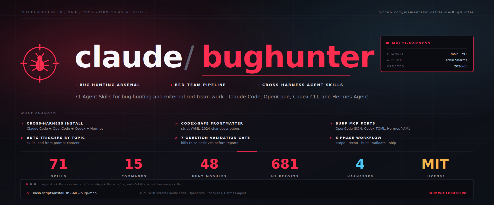

# claude-bughunter

> A self-contained Claude skill bundle for bug hunting and external red-team work · **71 skills** · 15 slash commands · **681 disclosed-report patterns** across 24 core vulnerability classes · enterprise identity + infrastructure attack matrices · engagement-folder scaffolding · Burp MCP integration · battle-tested across authorized red-team and bug-hunting engagements, plus public training platforms (DVWA, OWASP Juice Shop, Hacker101, testphp.vulnweb.com).

Built by **[Sachin Sharma](https://www.linkedin.com/in/sachinsharma8080/)** — Bug Hunting & GenAI Security Research.

<p align="center">
  <sub>SPONSORED BY</sub>
  <br/>
  <a href="https://www.atlascloud.ai/console/coding-plan">
    <picture>
      <source media="(prefers-color-scheme: dark)" srcset="assets/sponsors/atlas-cloud-dark.svg">
      
    </picture>
  </a>
</p>

---

## What is this?

`claude-bughunter` is a drop-in skill bundle for the [Claude Code skills system](https://docs.claude.com/en/docs/claude-code/skills). Install once and Claude Code stops being a chatbot and starts behaving like a senior bug-hunting researcher or red-team operator: it knows the techniques, the chain templates, the VRT mappings, the platform CVE chains, and the hygiene — and it stays in scope.

Four layers stack:

- **Think** — `bb-methodology` + `redteam-mindset`: the 5-phase non-linear workflow, critical-thinking framework, and red-team operator discipline.
- **Hunt webapps** — 48 `hunt-*` skills curated from 681 disclosed HackerOne reports: per-class detection patterns, payloads, bypass tables, and chain templates.
- **Hit the perimeter** — enterprise platform chains (M365/Entra, Okta, vCenter, SSL-VPN appliances, SharePoint, cloud IAM): current 2024–2026 CVE chains + post-credential escalation.
- **Ship it** — `triage-validation` + reporting + `evidence-hygiene`: the 7-Question Gate, VRT-aware severity, OOS rebuttals, PII redaction, and red-team deliverables.

All triggered automatically by topic — describe what you're testing in plain English and the relevant skill loads. No invocation by name.

---

## Quickstart

**Option A — install as a Claude Code plugin (recommended).** From inside Claude Code:

```text
/plugin marketplace add elementalsouls/Claude-BugHunter
/plugin install claude-bughunter@elementalsouls
```

All 71 skills + 15 commands load namespaced under `claude-bughunter:` and update when you bump the plugin version — no files copied into `~/.claude/`.

**Option B — copy install (no plugin system / pin to a clone):**

```bash
git clone https://github.com/elementalsouls/Claude-BugHunter.git
cd Claude-BugHunter
bash scripts/install.sh        # copies skills + commands into ~/.claude/
```

That's it. Open Claude Code and describe what you're testing in plain English — the right skill loads automatically, no invocation by name:

```text
> Testing acme.com — an in-scope HackerOne target. Run recon and rank the surface.

  ⟳ loading skills: web2-recon, offensive-osint, bb-methodology …
    → subdomain enum (subfinder + crt.sh) … 47 hosts
    → live hosts (httpx) … 12 · tech fingerprint … 6 distinct stacks
    → ranked surface: api.acme.com (GraphQL, introspection ON)  ← start here
                      auth.acme.com (OAuth, SSO)               ← hunt-oauth

  Next: want me to probe the GraphQL introspection + OAuth redirect_uri?
```

→ Full [Installation guide](INSTALL.md) · [Usage guide](USAGE.md) · [searchable skill catalog](docs/skills.md).

> The block above is an illustrative transcript. To record a real demo of your own session: `asciinema rec demo.cast` → upload to [asciinema.org](https://asciinema.org) and drop the badge here.

---

## Runs on four harnesses


The skills are plain [Agent Skills](https://docs.claude.com/en/docs/claude-code/skills) — the same `SKILL.md` format that **Claude Code · OpenCode · OpenAI Codex CLI · Hermes Agent** all load. One command installs them everywhere:

```bash
bash scripts/install.sh --all --burp-mcp
```

`--all` copies the skills to every harness's path (`~/.claude/skills`, `~/.agents/skills`, `~/.hermes/skills`); `--burp-mcp` wires the Burp MCP server into each. The full *knowledge* layer ports to all four — the slash commands and `/hunt` engine stay Claude-Code-only by design.

→ [Multi-harness guide](docs/multi-harness.md)

---

## Star History

<a href="https://www.star-history.com/?repos=elementalsouls%2FClaude-BugHunter&type=date&legend=top-left">
 <picture>
   <source media="(prefers-color-scheme: dark)" srcset="https://api.star-history.com/chart?repos=elementalsouls/Claude-BugHunter&type=date&theme=dark&legend=top-left" />
   <source media="(prefers-color-scheme: light)" srcset="https://api.star-history.com/chart?repos=elementalsouls/Claude-BugHunter&type=date&legend=top-left" />
   
 </picture>
</a>

---


## Scope — what this bundle is for, and what it isn't

This bundle covers the **external attack surface** — anything reachable from the internet without first compromising an internal endpoint.

### In scope

- **Bug bounty hunting** — web apps, APIs, SaaS, GraphQL, OAuth, JWT, file upload, IDOR, SSRF, RCE chains
- **Web application pentesting** — full hunt-* coverage of OWASP-mapped bug classes + discipline rules
- **External red-team engagements** — initial-access against internet-facing enterprise estate: M365 / Entra ID, Okta-as-IdP, SharePoint on-prem (ToolShell + legacy SOAP), VMware vCenter / Workspace ONE, SSL VPN appliances (Cisco / Fortinet / Citrix / Palo Alto / Pulse / SonicWall / F5), Android APK red-team, supply-chain recon
- **Cloud misconfig + post-credential escalation** — public S3, IMDS chains, STS AssumeRole, cross-account confused-deputy
- **Recon + OSINT** — subdomain enum, identity-fabric mapping, certificate transparency, JS analysis, secret scanning
- **Reporting** — H1, Bugcrowd (VRT-aware), Intigriti, Immunefi, plus client-facing red-team deliverable format

### Out of scope (deliberate — not gaps, design decisions)

- **Internal Active Directory attacks** — BloodHound, Kerberoasting, ASREProast, DCSync, Pass-the-Hash, AD CS abuse, ntlmrelayx, Responder, PetitPotam, etc. Different operational risk profile; needs different tooling and judgment. **Future bundle, not this one.**
- **C2 frameworks** — Cobalt Strike, Sliver, Mythic, Havoc, BRC4 tradecraft. Out of scope for external-only engagement model.
- **Post-exploit / persistence / lateral** — Mimikatz/comsvcs LSASS dumping, golden/silver tickets, named-pipe impersonation, persistence (registry, scheduled tasks, WMI events, COM hijacking), token theft. These start after the perimeter has already broken — different bundle territory.
- **Evasion** — AMSI bypass, ETW patching, AV/EDR bypass. Tied to C2 tradecraft above.
- **iOS pentesting / hardware / RF / ICS** — out of scope by design.
- **Binary exploitation / kernel pwn / browser internals** — different skill universe.

If you're running an internal red team that includes domain-takeover chains via Kerberos or lateral movement, **this bundle won't help you in those phases** — and we'd rather say that up front than have you find out mid-engagement. The external surface handoff to internal-RT tooling (Impacket, NetExec, CrackMapExec, Rubeus, Certify, BloodHound) is intentionally outside our scope. **Coverage for internal AD and post-exploit may come in a future update.**

---

## What's inside

**71 skills**, auto-loaded by topic — no invocation by name. Coverage across the external attack surface:

| Category | # | Examples |
|---|---|---|
| Web application hunting | 13 | XSS, SQLi, SSRF, IDOR, LFI, SSTI, XXE, CSRF, CORS, open-redirect |
| Authentication & identity | 7 | auth-bypass, session, OAuth, SAML, MFA-bypass, ATO |
| API & infrastructure | 15 | GraphQL, gRPC, WebSocket, API-misconfig, host-header, RCE |
| Advanced & concurrency | 6 | race-condition, HTTP smuggling, deserialization, cache-poison |
| Framework-specific | 4 | Next.js, Node.js, Laravel, Spring Boot |
| Enterprise identity & cloud ★ | 3 | M365/Entra, Okta, cloud-IAM-deep |
| Infrastructure & appliance ★ | 4 | VMware vCenter, enterprise VPN, SharePoint, ASP.NET/NTLM |
| Red-team tradecraft ★ | 4 | redteam-mindset, APK pipeline, supply-chain recon, mid-engagement IR |
| Recon & OSINT | 4 | web2-recon, offensive-osint, subdomain |
| Workflow, reporting & specialized | 11 | methodology, triage-validation, evidence-hygiene, VRT-aware reporting |

Full searchable catalog → **[docs/skills.md](docs/skills.md)**. Also ships **15 slash commands** (`/hunt`, `/recon`, `/report`, …) and a deterministic **engagement engine** (`engine/`) that maps a target's attack surface and routes each finding to the skill that handles it.

---

## How it works

A 6-phase, non-linear workflow — **recon → map & rank → hunt → validate → report** — with scope enforced in code and a **7-Question Gate** before anything is submitted. Two ways to drive it:

- **Plain English** — describe what you're testing and the relevant skill loads automatically.
- **`/hunt` scaffold + `cbh` CLI** — engagement-folder structure, state, and orchestration.

→ [Usage guide & worked example](USAGE.md) · [6-phase architecture & skill-to-phase map](docs/architecture.md) · [`cbh` CLI](docs/cbh-cli.md)

---
## Authorization

These skills are intended for assets you **own** or have **written authorization to assess** (bug-bounty in-scope assets, pentest engagement letters, CTF challenges, your own infrastructure).

The skills include validation gates that auto-trigger when you point Claude at unverified third-party targets — `triage-validation`'s 7-Question Gate explicitly asks whether the asset is in scope (Q3) and on the program's accepted-impact list (Q2). The `bugcrowd-reporting` skill includes researcher-side hygiene (Bugcrowdninja alias, account-state restoration, friendly-tester posture) that signals legitimate authorized testing to the target's fraud team.

The bundle explicitly **excludes**: weaponizing 0-days against unauthorized targets, post-exploitation tooling, malware development, mass-targeting infrastructure. See [`SECURITY.md`](SECURITY.md) for the full posture.

> **Heads-up — Anthropic runtime cyber safeguards.** Anthropic's models apply real-time safeguards that **block "vulnerability exploitation or offensive security tooling development" by default** — so even *authorized, in-scope* work can hit a refusal that isn't this bundle's doing. If you do authorized offensive security (pentest / bug bounty / red team), enroll in Anthropic's **free, application-based [Cyber Verification Program (CVP)](https://claude.com/form/cyber-use-case)** to get safeguards adjusted for legitimate dual-use work. (Mass data exfiltration and ransomware development stay prohibited and are *not* adjustable.) Details: [Anthropic — real-time cyber safeguards](https://support.claude.com/en/articles/14604842-real-time-cyber-safeguards-on-claude).

---

## Documentation

| Doc | Contents |
|---|---|
| [`README.md`](README.md) | This file — overview, quickstart, scope, skill summary |
| [`INSTALL.md`](INSTALL.md) | Full setup with Burp MCP integration and optional skill regenerator |
| [`USAGE.md`](USAGE.md) | Workflow walkthrough · decision tree · worked engagement example |
| [`docs/architecture.md`](docs/architecture.md) | 6-phase architecture · skill-to-phase mapping · engagement composition |
| [`docs/cbh-cli.md`](docs/cbh-cli.md) | `cbh` CLI — native runner orchestrating recon + classify + triage + report |
| [`docs/cve-coverage.md`](docs/cve-coverage.md) | CISA KEV coverage snapshot — refreshed weekly via the workflow template at `docs/automation/cve-refresh.yml.template` |
| [`docs/credits.md`](docs/credits.md) | Full attribution: 43 original skills + 8 vendored from upstream |
| [`CONTRIBUTING.md`](CONTRIBUTING.md) | PR guidelines · skill quality standards · scope |
| [`SECURITY.md`](SECURITY.md) | Authorized-use posture · responsible disclosure · what's excluded |
| [`LICENSE`](LICENSE) | MIT |

---

## Why this exists

Most bug-hunting Claude setups are either too generic (one big "security" prompt) or too fragmented (you bookmark 30 disclosed reports and re-read them every engagement). Neither scales past the second target.

This bundle was built and validated through authorized engagements that exposed different capability gaps:

**Bug-bounty engagement** — surfaced four gaps a starter 3-skill stack could not close:

1. **No hypothesis discipline** — drafts written before validation → wasted hours, hurt validity ratio
2. **No per-program reporting tactics** — VRT defaults auto-downgraded P3-worthy findings to P4
3. **No engagement coordination** — findings, evidence, and submission IDs scattered across folders
4. **No evidence hygiene** — screenshots leaked cookies and victim PII

**External red-team engagement** — exposed five additional gaps that bug-bounty defaults made worse:

1. **Conservative defaults retracted real findings** — WAPT mindset stopped tests early on defended targets where red-team continuation would have surfaced bypass chains → `redteam-mindset`
2. **No mid-engagement situational awareness** — client SOC patched confirmed SQLi within 30 min; external attacker locked 14 accounts during a live test session — both invisible without explicit detection methodology → `mid-engagement-ir-detection`
3. **No enterprise-platform attack chains** — M365 + Entra ID, on-prem SharePoint, Cisco SSL VPN, vCenter, and 7 Android APKs all needed current 2024-2026 CVE knowledge and platform-specific tradecraft → `m365-entra-attack`, `okta-attack`, `hunt-sharepoint`, `hunt-aspnet`, `hunt-ntlm-info`, `vmware-vcenter-attack`, `enterprise-vpn-attack`, `apk-redteam-pipeline`
4. **No client-facing deliverable format** — bug-bounty report templates don't fit enterprise red-team where output is a 50KB+ MD + DOCX with embedded screenshots → `redteam-report-template`
5. **No post-credential escalation model** — when recon yielded credentials (AWS keys, JWTs, GCP JSON), it was unclear what they granted or how to escalate → `cloud-iam-deep`

The per-class `hunt-*` skills address gap-zero (*"what should I look for in webapps"*) — the original 24 codifying patterns from 681 disclosed HackerOne reports, with 20+ framework/surface skills added by the community v3 expansion — Claude knows the actual chain templates real triagers paid for, not abstract OWASP Top 10. The enterprise-platform and red-team-tradecraft layers address what bug-bounty alone cannot: external red-team engagements against monitored enterprise targets.

---

## Roadmap

- [ ] HackerOne MCP integration (currently only Burp MCP wired in)
- [ ] Per-engagement memory layer — pattern recall across targets
- [ ] Industry-specific hunt skills — `hunt-fintech-graphql`, `hunt-healthcare-fhir`, `hunt-gov-compliance`
- [ ] Program-rules-parser skill — auto-generate structured `scope.md` from program text
- [ ] Refresh `hunt-*` skills with newer disclosed reports (re-run `public-skills-builder`)
- [ ] Additional enterprise-platform skills — `citrix-netscaler-deep`, `f5-bigip-attack`, `ad-cs-attack` (AD Certificate Services)
- [ ] Refresh enterprise-VPN CVE matrix quarterly to track 2026 advisories
- [ ] Update architecture SVG to include the 7-skill enterprise-platform layer

---

## Sponsors

<p align="center">
  <a href="https://www.atlascloud.ai/console/coding-plan">
    <picture>
      <source media="(prefers-color-scheme: dark)" srcset="assets/sponsors/atlas-cloud-dark.svg">
      
    </picture>
  </a>
</p>

**[Atlas Cloud](https://www.atlascloud.ai/console/coding-plan)** is a full-modal AI inference platform that gives developers a single AI API to access video generation, image generation, and LLM APIs. Instead of managing multiple vendor integrations, you connect once and get unified access to 300+ curated models across all modalities.

Check out Atlas Cloud's new coding plan promotion for more budget-friendly API access: **<https://www.atlascloud.ai/console/coding-plan>**

---

## About

Operational tradecraft accumulated across bug-bounty engagements and authorized pentests, codified into Claude skills. Platform-agnostic — slot into any engagement workflow you already use, or none.

**Author:** [ElementalSoul](https://github.com/elementalsouls) · GenAI Security Research

**Sister project:** [Claude-OSINT](https://github.com/elementalsouls/Claude-OSINT) — paired skills for the recon phase that this bundle picks up after.

**Vendored foundation:** [shuvonsec/claude-bug-bounty](https://github.com/shuvonsec/claude-bug-bounty) — methodology, validation, reporting, payload library (8 of 71 skills + 15 slash commands)

**Generator tool used (not vendored):** [shuvonsec/public-skills-builder](https://github.com/shuvonsec/public-skills-builder) — used to scaffold per-class skills from H1 disclosed reports

**Inspirations:**
- [archangel / douglasday](https://hackerone.com/) — top-10 H1 hunter; per-class skill pattern
- [Trail of Bits — `trailofbits/skills`](https://github.com/trailofbits/skills) — skill-authoring discipline
- [SecSkills — `trilwu/secskills`](https://github.com/trilwu/secskills) — subagent pattern

**Tool inventory:**
- [PortSwigger Burp Suite + MCP Server extension](https://portswigger.net/burp)
- [ProjectDiscovery](https://github.com/projectdiscovery) — subfinder · dnsx · httpx · katana · nuclei
- [SecLists](https://github.com/danielmiessler/SecLists) · [Assetnote Wordlists](https://wordlists.assetnote.io/)

**License:** [MIT](LICENSE) — use freely, attribution appreciated.

---

> *"Give Claude the right skill and it stops being a chatbot. It becomes an operator."*
