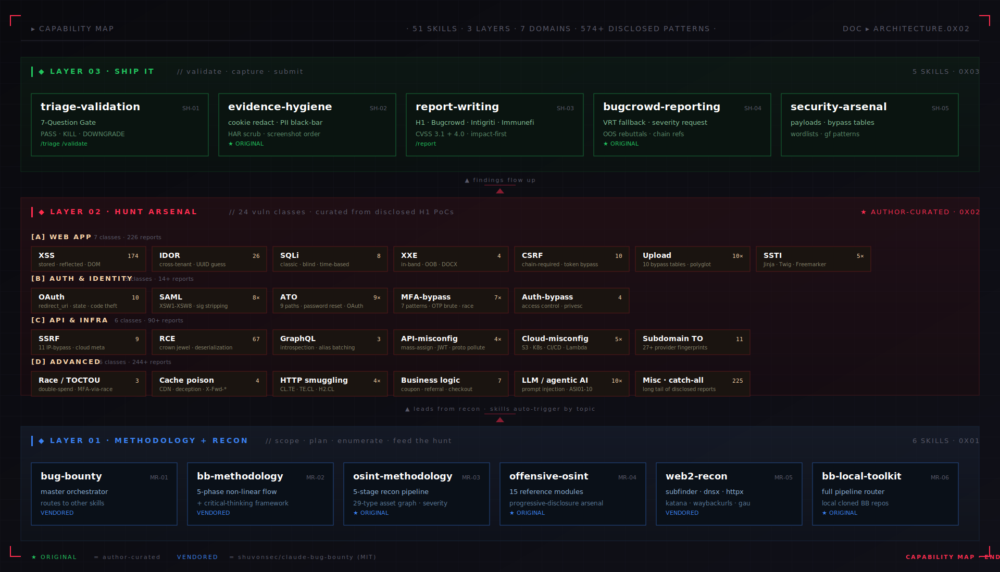
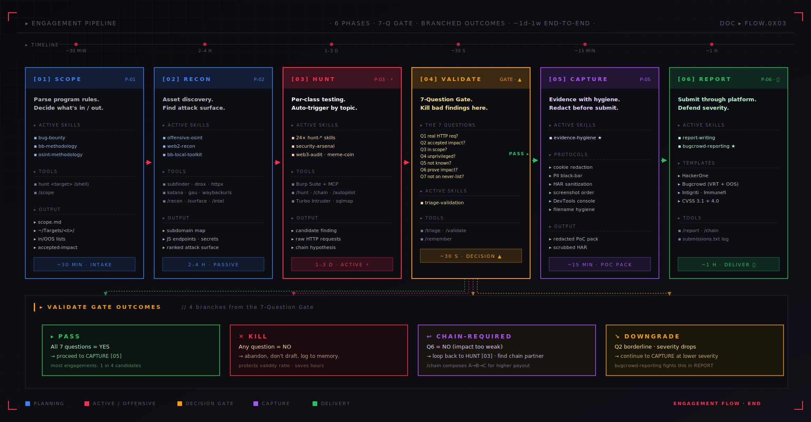

# Architecture

The Claude-BugHunter bundle maps to a 6-phase workflow that supports both bug hunting and external red-team engagements. Each phase has a focused set of skills; skills compose left-to-right as you move through the workflow, but you can jump in at any phase mid-engagement.

## Primary view — phase-by-phase architecture

71 skills mapped to 6 phases, with a 48-skill `hunt-*` sub-stack, a 7-skill enterprise-platform attack layer, integration layer, and usage decision tree. This is the main reference for "which skill do I use when?".


The "Source" column in the per-phase tables below tags each skill: **`original`** = author's work in this repo, `community` = community-contributed (v3), `vendored` = from [shuvonsec/claude-bug-bounty](https://github.com/shuvonsec/claude-bug-bounty) (MIT). Of 71 skills: 43 original, 20 community (v3), 8 vendored.

## Alternate view — 3-layer capability stack

The same 71 skills, regrouped by **role in an engagement** rather than by phase. Methodology + Recon (bottom) feeds the Hunt Arsenal (middle), which produces findings that flow up through Ship It (top) to a paid submission or client deliverable.



## Alternate view — engagement pipeline with branched outcomes

The 6-phase workflow expanded into a pipeline showing per-phase active skills, tools, output, time budgets, and the **4 branched outcomes** of the Validate gate (PASS · KILL · CHAIN-REQUIRED · DOWNGRADE).



---

---

## Phase 1 — SCOPE (program intake, planning)

**Use when**: starting a new program, parsing scope, deciding what's in/out

| Skill | Source | Purpose |
|---|---|---|
| `bug-bounty` | vendored | Master orchestrator — pulls in other skills as needed |
| `bb-methodology` | vendored | 5-phase workflow + hunting mindset |
| **`osint-methodology`** | original | Recon framework, 29-type asset graph, time budgeting |
| **`bb-local-toolkit`** | original | Full pipeline router for local cloned bug-bounty repos |
| **`hunt <target>` (shell)** | original | Scaffolds `~/Targets/<name>/` with full template |

## Phase 2 — RECON (discovery)

**Use when**: asset enumeration, subdomain discovery, secret hunting, identity-fabric mapping

| Skill | Source | Purpose |
|---|---|---|
| **`offensive-osint`** | original | 15-reference probe/regex/dork arsenal — loads on demand |
| `web2-recon` | vendored | Subdomain enumeration, host discovery, URL crawling |
| **`bb-local-toolkit`** | original | Routes to local cloned bug-bounty repos when applicable |

## Phase 3 — HUNT (active testing)

**Use when**: testing for specific vulnerability classes

| Skill | Source | Purpose |
|---|---|---|
| **48 `hunt-*` skills** | original + community | Per vuln class / framework, curated from disclosed H1 reports + v3 community expansion — auto-trigger by topic |
| `security-arsenal` | vendored | Payload library (XSS / SSRF / SQLi / SSTI / etc.) |
| `web3-audit` | vendored | Smart-contract audit (10 bug classes, Foundry PoC) |
| `meme-coin-audit` | vendored | Token rug-pull detection |

### Per-class hunt skills (48)

```
hunt-api-misconfig                      hunt-mfa-bypass
hunt-aspnet           (1)               hunt-misc             (225)
hunt-ato                                hunt-nextjs           (19)
hunt-auth-bypass      (12)              hunt-nodejs           (24)
hunt-brute-force      (33)              hunt-nosqli           (14)
hunt-business-logic   (12)              hunt-ntlm-info        (1)
hunt-cache-poison     (10)              hunt-oauth            (19)
hunt-cicd             (18)              hunt-open-redirect    (28)
hunt-cloud-misconfig                    hunt-race-condition   (12)
hunt-cors             (19)              hunt-rce              (67)
hunt-csrf             (15)              hunt-saml
hunt-deserialization  (22)              hunt-session          (18)
hunt-dom              (17)              hunt-sharepoint       (1)
hunt-file-upload                        hunt-source-leak      (31)
hunt-graphql          (12)              hunt-springboot       (16)
hunt-grpc             (6)               hunt-sqli             (12)
hunt-host-header      (16)              hunt-ssrf             (15)
hunt-http-smuggling                     hunt-ssti
hunt-idor             (26)              hunt-subdomain        (15)
hunt-k8s              (13)              hunt-tls-network      (9)
hunt-laravel          (14)              hunt-websocket        (11)
hunt-ldap             (8)               hunt-xss              (174)
hunt-lfi              (31)              hunt-xxe              (10)
hunt-llm-ai
```

Plus alternates: `hunt-cache-poison`, `hunt-race-condition`, `hunt-subdomain`. Plus the meta-router `hunt-dispatch` (used internally by the `/hunt` slash command — not user-invoked).

**Total disclosed reports curated**: 681 (plus enterprise CVE catalogues that aren't measured in H1-report counts)

**How auto-triggering works**: just describe what you're testing — e.g., *"I see a `?url=` parameter on this endpoint"* — and Claude loads only `hunt-ssrf`. You don't invoke them by name.

### Enterprise platform attack (Phase 3 expansion — 7 skills)

External red-team engagements against enterprise estates need attack chains for full platform stacks, not just webapps. These 7 skills extend Phase 3 with current 2024-2026 CVE chains and platform-specific tradecraft.

| Skill | Source | Purpose |
|---|---|---|
| **`m365-entra-attack`** | original | M365 / Entra ID full chain — AADSTS error reference, user enum, Smart Lockout math, CA bypass, ROPC, SAML SSO browser flow |
| **`okta-attack`** | original | Okta-as-IdP — tenant discovery, factor enum, push fatigue, FastPass abuse, OIDC redirect_uri tampering |
| **`cloud-iam-deep`** | original | AWS / Azure / GCP IAM priv-esc — STS chaining, IMDS, K8s SA tokens, confused-deputy. Post-credential escalation model. |
| **`vmware-vcenter-attack`** | original | vSphere / vCenter / Workspace ONE / Aria CVE chain (CVE-2021-21972 → CVE-2024-37085) |
| **`enterprise-vpn-attack`** | original | Cisco ASA, Fortinet, Citrix NetScaler, PAN GlobalProtect, Pulse/Ivanti, SonicWall, F5 SSL VPN |
| **`apk-redteam-pipeline`** | original | Android APK red-team pipeline — acquisition → jadx → secret grep → Frida instrumentation |
| **`supply-chain-attack-recon`** | original | Dep-confusion, GH Actions injection, SBOM mining, container registry exposure (recon only, no publish-step) |

### Red-team tradecraft (cross-phase — 2 skills)

| Skill | Source | Purpose |
|---|---|---|
| **`redteam-mindset`** | original | Load at the start of any red-team engagement. Operator-discipline corrections separating offensive from defensive WAPT. |
| **`mid-engagement-ir-detection`** | original | Detect SOC patches mid-test, external attacker activity, baseline shifts → convert observations into deliverable findings |

## Phase 4 — VALIDATE (the gate before reporting)

**Use when**: you think you have a finding — BEFORE drafting any report

| Skill | Source | Purpose |
|---|---|---|
| `triage-validation` | vendored | 7-Question Gate, 4 pre-submission gates, never-submit list |

Slash commands: `/triage`, `/validate`

The 7-Question Gate:

1. Can an attacker use this RIGHT NOW with a real HTTP request?
2. Is the impact on the program's accepted impact list?
3. Is the asset in scope?
4. Does it work without privileged access an attacker can't get?
5. Is this not already known or documented behavior?
6. Can impact be proved beyond "technically possible"?
7. Is this not on the never-submit list?

One NO = KILL. Move on. This single discipline is what separates productive researchers from the noise.

## Phase 5 — CAPTURE (evidence hygiene)

**Use when**: about to take a screenshot, export a HAR, or attach evidence

| Skill | Source | Purpose |
|---|---|---|
| **`evidence-hygiene`** | original | Cookie redaction, PII black-bar, HAR sanitization, screenshot capture order |

Covered protocols:
- Cookie redaction (which fields, what tools, screenshot timing)
- PII black-bar (other-user data, faces, addresses, SSNs)
- HAR file sanitization (jq filters)
- Burp screenshot hygiene (Repeater, Intruder, Proxy)
- DevTools Console PoC patterns
- Filename conventions for multi-step PoCs
- Post-submission rotation hygiene

## Phase 6 — REPORT (submission)

**Use when**: drafting the final report

| Skill | Source | Purpose |
|---|---|---|
| `report-writing` | vendored | H1 / Bugcrowd / Intigriti / Immunefi templates, CVSS 3.1 + 4.0 |
| **`bugcrowd-reporting`** | original | Bugcrowd VRT search, severity-request paragraph, OOS rebuttals |
| **`redteam-report-template`** | original | Client-facing red-team deliverable — Subject / Observations / Description / Impact / Recommendation / PoC. MD + DOCX packaging with embedded screenshots. |

Slash command: `/report`

---

## Integration layer

Tools the skills call into during the workflow.

| Tool | Purpose |
|---|---|
| **Burp MCP** | Claude reads/replays HTTP traffic directly from Burp's proxy history. Eliminates manual paste-curl-into-chat. |
| **`hunt` shell command** | Engagement-folder scaffold (`~/Targets/<name>/CLAUDE.md` + scope.md + findings/ + evidence/ + submissions.txt + notes.md + .gitignore). |
| **HackerOne API** | Used externally with `public-skills-builder` to refresh `hunt-*` skill content from newly disclosed reports. |

---

## Composition example — full engagement walkthrough

```
1. SCOPE
   $ hunt acme-bb              → scaffolds ~/Targets/acme-bb/
   $ cd ~/Targets/acme-bb
   $ claude                    → opens Claude Code in this folder
   "Help me parse the program page into scope.md"
   → triggers bb-methodology, populates scope.md

2. RECON
   "Run external recon on *.acme.com"
   → triggers offensive-osint + web2-recon
   → suggests: certificate transparency, JS endpoint extraction, S3 enum

3. HUNT
   "I see /api/users/{id}/orders in JS — testing IDOR with two test accounts"
   → triggers hunt-idor
   → walks through detection patterns, payloads, two-account verification

4. VALIDATE
   /triage
   "I get back the victim's order data when I change the user_id"
   → 7-Question Gate
   → returns PASS (assuming all checks pass)

5. CAPTURE
   "About to take a screenshot of the IDOR PoC"
   → triggers evidence-hygiene
   → reminds you to redact cookies, mask victim PII

6. REPORT
   /report
   → triggers report-writing + bugcrowd-reporting
   → produces ready-to-paste body + VRT mapping + severity request paragraph
```

---

## Skill-loading mechanics

**Auto-trigger**: Skills load when their description matches your prompt. The skill matcher uses the `description` field in the YAML frontmatter.

**Progressive disclosure**: Large skills (e.g., `offensive-osint`) keep SKILL.md lean and put detailed reference content in subfolders that load only when needed.

**Slash commands**: Some skills have explicit slash-command invocations (`/triage`, `/validate`, `/report`, `/recon`, `/hunt`, `/scope`, etc.) that force-load the relevant skill.

---

## What's NOT in the bundle (intentional gaps)

- **No automated exploitation tooling** — this bundle guides hunting and reporting; it doesn't fire payloads automatically. Use Burp's Active Scanner, sqlmap, etc. for automated work.
- **No CI/CD integration** — this is a workflow stack for individual researchers, not a continuous scanning pipeline.
- **No secret leak deletion** — if the stack helps you find leaked credentials, you (and the program) handle remediation.
- **iOS testing not covered** — `apk-redteam-pipeline` covers Android only. For iOS, use `Mobile-Security-Framework-MobSF` or Burp Mobile Assistant.

---

## Further reading

- [USAGE.md](../USAGE.md) — full usage walkthrough with worked example
- [INSTALL.md](../INSTALL.md) — step-by-step setup
- [docs/credits.md](credits.md) — full attribution to upstream sources
- [shuvonsec/claude-bug-bounty](https://github.com/shuvonsec/claude-bug-bounty) — vendored foundation
